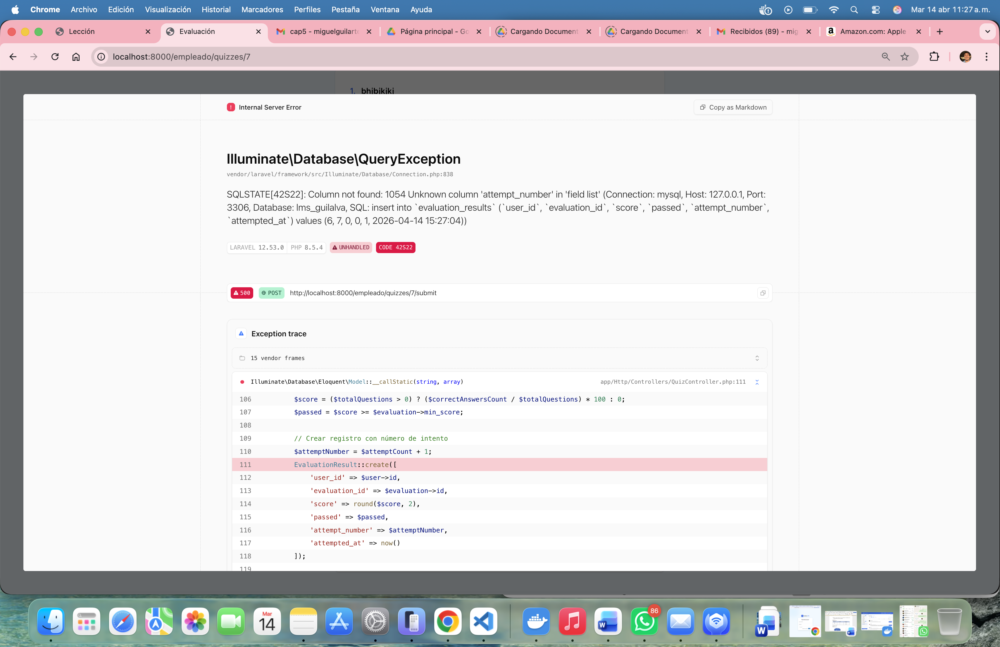

# Análisis: Tasa de Finalización (Completion Rate) en el Codebase

## 📋 Resumen Ejecutivo

Se encontraron **dos implementaciones paralelas** de cálculo de tasa de finalización:
1. **Dashboard Empleado** - Calcula porcentaje de lecciones completadas por usuario
2. **Dashboard Gerente** - Calcula tasa de finalización global de cursos por departamento

**PROBLEMA CRÍTICO DETECTADO**: El trigger SQL para actualizar enrollments a "completado" NO considera las evaluaciones finales requeridas.

---

## 🔍 Archivo de Cálculo Principal #1: EmpleadoController

**Ubicación**: [app/Http/Controllers/EmpleadoController.php](app/Http/Controllers/EmpleadoController.php#L14-L75)

### Lógica de Cálculo (Líneas 34-72):

```php
// Calcular porcentaje de lecciones completadas
$totalLessons = $course->lessons_count;
$percentage = 0;

if ($totalLessons > 0) {
    $completedCount = ProgressLog::where('user_id', $userId)
        ->whereIn('lesson_id', function($query) use ($course) {
            $query->select('id')->from('lessons')->where('course_id', $course->id);
        })
        ->where('is_completed', true)
        ->count();
    $percentage = round(($completedCount / $totalLessons) * 100);
}

// Verificar evaluaciones
$hasEvaluations = $course->evaluations->count() > 0;
$passedEvaluations = false;
if ($hasEvaluations) {
    $passedEvaluations = auth()->user()->evaluationResults()
        ->whereIn('evaluation_id', $course->evaluations->pluck('id'))
        ->where('passed', true)
        ->exists();
}

// Lógica de finalización: 100% de lecciones + ALL evaluaciones aprobadas
$isFullyCompleted = ($percentage >= 100);
if ($hasEvaluations) {
    $isFullyCompleted = $isFullyCompleted && $passedEvaluations;
}

// Se envía al componente Vue
$courseProgress[$course->id] = [
    'percentage' => $percentage,           // 0-100%
    'is_completed' => $isFullyCompleted,   // true/false
    'has_evaluations' => $hasEvaluations,  // true/false
    'passed_evaluations' => $passedEvaluations // true/false
];
```

### Datos Enviados a Vue:
- **courseProgress**: Array con progreso de cada curso
- Se muestra en: [resources/js/Pages/Empleado/Dashboard.vue](resources/js/Pages/Empleado/Dashboard.vue)

---

## 🔍 Archivo de Cálculo Principal #2: GerenteController

**Ubicación**: [app/Http/Controllers/GerenteController.php](app/Http/Controllers/GerenteController.php#L1-L56)

### Lógica de Cálculo (Líneas 27-53):

```php
$courseMetrics = Course::query()
    ->select('courses.id', 'courses.title')
    ->withCount(['enrollments as total_enrolled' => function ($query) use ($user) {
        // Contar inscripciones totales del departamento
        $query->whereHas('user', function ($query) use ($user) {
            $query->where('area_id', $user->area_id);
        });
    }])
    ->get()
    ->map(function ($course) use ($user) {
        // Promedio de calificaciones
        $avgScore = EvaluationResult::query()
            ->selectRaw('AVG(evaluation_results.score) as avg_score')
            ->join('evaluations', 'evaluation_results.evaluation_id', '=', 'evaluations.id')
            ->join('users', 'evaluation_results.user_id', '=', 'users.id')
            ->where('evaluations.course_id', $course->id)
            ->where('users.area_id', $user->area_id)
            ->value('avg_score');

        // CÁLCULO DE TASA DE FINALIZACIÓN
        $completions = $course->enrollments()
            ->whereHas('user', function ($query) use ($user) {
                $query->where('area_id', $user->area_id);
            })
            ->whereIn('status', ['completado', 'completed'])  // ⚠️ VERIFICA status
            ->count();

        $completionRate = $course->total_enrolled 
            ? round(($completions / $course->total_enrolled) * 100, 2) 
            : 0;

        return [
            'id' => $course->id,
            'title' => $course->title,
            'total_enrolled' => $course->total_enrolled,
            'avg_score' => round($avgScore ?? 0, 2),
            'completion_rate' => $completionRate,
        ];
    });
```

### Datos Enviados a Vue:
```php
courseMetrics: [
    {
        'id': number,
        'title': string,
        'total_enrolled' => number,
        'avg_score' => float,
        'completion_rate' => float (0-100)
    }
]
```

- Se muestra en: [resources/js/Pages/Gerente/Dashboard.vue](resources/js/Pages/Gerente/Dashboard.vue)

---

## 🎨 Componentes Vue Que Muestran Métricas

### 1. Dashboard Empleado
**Archivo**: [resources/js/Pages/Empleado/Dashboard.vue](resources/js/Pages/Empleado/Dashboard.vue)

**Líneas Clave**:
- **L43-56**: Progress Bar con estado visual
- **L58-72**: Muestra "Curso Completado" o "Inscrito" 
- **L73**: Link a continuar curso

```vue
<!-- Progress Bar -->
<div class="bg-blue-600 h-full rounded-full transition-all duration-1000 ease-out" 
     :style="{ width: getCourseData(course.id).percentage + '%' }"></div>

<!-- Status Display -->
<span :class="getCourseData(course.id).is_completed ? 'text-green-600' : 'text-blue-600'">
    {{ getCourseData(course.id).is_completed ? 'Certificado Listo' : 'Inscrito' }}
</span>
```

### 2. Dashboard Gerente
**Archivo**: [resources/js/Pages/Gerente/Dashboard.vue](resources/js/Pages/Gerente/Dashboard.vue)

**Líneas Clave**:
- **L29**: "Tasa de Finalización" label
- **L22-30**: Pie Chart con completion_rate de cada curso
- **L85-95**: Tabla con detalles

```vue
<!-- Pie Chart de Finalización -->
const courseChartData = {
    labels: props.courseMetrics.map(m => m.title),
    datasets: [{
        label: 'Tasa de Finalización',
        data: props.courseMetrics.map(m => m.completion_rate),
        backgroundColor: ['#ef4444', '#f59e0b', '#10b981', '#3b82f6', '#8b5cf6']
    }]
};

<!-- Table Row -->
<td class="px-6 py-4 text-center">
    <span class="px-2 py-1 text-xs font-bold rounded"
          :class="course.completion_rate > 70 ? 'bg-green-100 text-green-800' : 'bg-yellow-100 text-yellow-800'">
        {{ course.completion_rate }}%
    </span>
</td>
```

---

## 📊 Modelos Relacionados

### ProgressLog
**Archivo**: [app/Models/ProgressLog.php](app/Models/ProgressLog.php)

```php
class ProgressLog extends Model {
    protected $fillable = [
        'user_id', 
        'lesson_id', 
        'time_spent_seconds', 
        'is_completed'  // ⚠️ Campo clave
    ];
    
    public function user(): BelongsTo { ... }
    public function lesson(): BelongsTo { ... }
}
```

**Relaciones**:
- Creado/Actualizado en: `EmpleadoController::completeLesson()` (línea 140)
- Consultado en: `EmpleadoController::dashboard()` (línea 44)

### EvaluationResult
**Archivo**: [app/Models/EvaluationResult.php](app/Models/EvaluationResult.php)

```php
class EvaluationResult extends Model {
    protected $fillable = [
        'user_id', 
        'evaluation_id', 
        'score', 
        'passed',        // ⚠️ Campo clave
        'attempted_at'
    ];
    
    public function user(): BelongsTo { ... }
    public function evaluation(): BelongsTo { ... }
}
```

**Relaciones**:
- Consultado en: `EmpleadoController::dashboard()` (línea 54)
- Consultado en: `GerenteController::dashboard()` (línea 34)

### Enrollment
**Archivo**: [app/Models/Enrollment.php](app/Models/Enrollment.php)

```php
class Enrollment extends Model {
    protected $fillable = [
        'user_id', 
        'course_id', 
        'status',         // ⚠️ Campo problemático
        'enrolled_at', 
        'completed_at'
    ];
}
```

**Estados en BD**:
- SQL Schema: `ENUM('en_progreso', 'completado', 'desertor')`
- Creado en: `EmpleadoController::showCourse()` (línea 97) con `status = 'en_progreso'`
- Filtrado en: `GerenteController::dashboard()` (línea 44) buscando `'completado'` o `'completed'`

---

## 🚨 PROBLEMAS CRÍTICOS DETECTADOS

### ⚠️ PROBLEMA 1: Trigger SQL NO considera evaluaciones

**Ubicación**: [docker/mysql/init/01-schema.sql](docker/mysql/init/01-schema.sql#L128-L165)

El trigger que actualiza `enrollments.status = 'completado'` **SOLO verifica lecciones completadas**:

```sql
TRIGGER check_course_completion
AFTER UPDATE ON progress_logs
BEGIN
    -- Si todas las LECCIONES están completadas...
    IF total_lessons = lessons_completed AND total_lessons > 0 THEN
        UPDATE enrollments 
        SET status = 'completado', completed_at = NOW() 
        WHERE user_id = NEW.user_id AND course_id = course_id_var;
    END IF;
END
```

**IMPACTO**:
- El enrollment se marca como 'completado' ANTES de que el usuario apruebe evaluaciones
- Resultado: `completion_rate` en Gerente muestra usuarios "completados" que NO aprobaron el examen
- La lógica correcta: `percentage >= 100 AND passed_evaluations = true` (línea 60 de EmpleadoController) NO se refleja en el BD

### ⚠️ PROBLEMA 2: Discrepancia de estados en BD

**Migración Laravel** [2026_03_03_161112_create_enrollments_table.php](database/migrations/2026_03_03_161112_create_enrollments_table.php):
```php
$table->string('status')->default('enrolled'); // enrolled, in_progress, completed
```

**Values usados en código**:
- `EmpleadoController` (L97): `'en_progreso'`
- `GerenteController` (L44): `whereIn('status', ['completado', 'completed'])`
- SQL Schema: `ENUM('en_progreso', 'completado', 'desertor')`

**Problemas**:
- La migración define `default='enrolled'` pero se usa `'en_progreso'` en código
- Se buscan `'completado'` y `'completed'` (ambos: español e inglés) cuando solo existe `'completado'`
- Inconsistencia entre schema SQL y migraciones Laravel

### ⚠️ PROBLEMA 3: NO hay actualización del enrollment después de evaluar

**EmpleadoController**:
- ✅ Calcula correctamente: `isFullyCompleted = (percentage >= 100) && passedEvaluations`
- ❌ **NO actualiza** `enrollments.status` después de aprobar evaluación

**QuizController**:
- Solo registra `EvaluationResult` con `score` y `passed`
- ❌ **NO actualiza** el enrollment correspondiente

**Resultado**: El estado en BD y los datos en Vue pueden estar desincronizados:
- Vue dashboard muestra `is_completed = true` (lógica correcta)
- BD tiene `enrollment.status = 'en_progreso'` (desactualizado)
- GerenteController lee de BD, mostrando métricas incorrectas

### ⚠️ PROBLEMA 4: Vista desincronizada

[resources/js/Pages/Empleado/CourseView.vue](resources/js/Pages/Empleado/CourseView.vue) (L7):

```vue
const allLessonsCompleted = computed(() => {
    return props.lessons.length > 0 && props.completedLessons.length === props.lessons.length;
});
```

**No valida evaluaciones**. Basado solo en lecciones, pero:
- El componente muestra advertencia si faltan lecciones (L115)
- ✅ Correcto: No permite examen sin completar lecciones
- ❌ NO muestra advertencia si evaluación no está aprobada después de 100% lecciones

---

## 📍 Flujo Visual de Datos

```
┌─────────────────────────────────────────────────────────────┐
│                     FLUJO DE CÁLCULO                        │
└─────────────────────────────────────────────────────────────┘

[ProgressLog] ──(is_completed=true)──┐
                                      │
                                      ▼
                         [EmpleadoController::dashboard()]
                                      │
                    ┌─────────────────┼─────────────────┐
                    │                 │                 │
                    ▼                 ▼                 ▼
            [percentage]     [has_evaluations]  [passed_evaluations]
                0-100%            true/false         true/false
                    │                 │                 │
                    └─────────────────┼─────────────────┘
                                      │
                                      ▼
                        [is_completed = boolean]
                      (100% lecciones + evaluaciones)
                                      │
                                      ▼
                            [Vue: Dashboard]
                      (Muestra estado correcto ✅)
                                      │
                                      
                    ⚠️ AQUÍ FALLA LA SINCRONIZACIÓN ⚠️
                                      │
                                      ▼
                    [Enrollment.status en BD]
                    (Actualizado por TRIGGER SQL)
                    ❌ Solo valida lecciones, NO evaluaciones
                                      │
                                      ▼
                        [GerenteController::dashboard()]
                                      │
                                      ▼
                        [completion_rate = INCORRECTO]
                         (Cuenta completados sin examen)
                                      │
                                      ▼
                        [Vue: Gerente Dashboard]
                      (Muestra métricas incorrectas ❌)
```

---

## 🔧 Recomendaciones de Solución

### Opción A: Sincronizar con BD (Recomendado)

1. **Actualizar QuizController** para marcar enrollment como 'completado' cuando:
   ```php
   if ($allEvaluationsPassed && $allLessonsCompleted) {
       $enrollment->update(['status' => 'completado', 'completed_at' => now()]);
   }
   ```

2. **Eliminar o modificar trigger SQL** para incluir validación de evaluaciones

3. **Estandarizar estados** en migración: usar solo `'en_progreso'`, `'completado'`, `'desertor'`

### Opción B: Calcular dinámicamente (Sin cambios BD)

1. Modificar `GerenteController::dashboard()` para calcular como EmpleadoController:
   ```php
   $completions = 0;
   foreach ($course->enrollments where area = $user->area) {
       $percentage = calcularPorcentajeLecciones($user, $course);
       $passedEvaluation = $user->evaluationResults()->passed()->exists();
       if ($percentage >= 100 && $passedEvaluation) {
           $completions++;
       }
   }
   ```

2. Ventaja: Mayor precisión
3. Desventaja: Query más pesada

---

## 📁 Archivos Clave Resumen

| Archivo | Función | Líneas | Problema |
|---------|---------|--------|----------|
| [app/Http/Controllers/EmpleadoController.php](app/Http/Controllers/EmpleadoController.php) | Calcula porcentaje de lecciones | 34-72 | ✅ Correcto, pero NO actualiza BD |
| [app/Http/Controllers/GerenteController.php](app/Http/Controllers/GerenteController.php) | Calcula tasa finalización global | 27-53 | ❌ Lee de BD desactualizada |
| [app/Http/Controllers/QuizController.php](app/Http/Controllers/QuizController.php) | Valida exámenes | - | ❌ NO actualiza enrollment.status |
| [app/Models/Enrollment.php](app/Models/Enrollment.php) | Modelo de inscripción | - | ⚠️ Status no se sincroniza correctamente |
| [docker/mysql/init/01-schema.sql](docker/mysql/init/01-schema.sql#L128) | Trigger de actualización | 128-165 | ❌ NO valida evaluaciones |
| [resources/js/Pages/Empleado/Dashboard.vue](resources/js/Pages/Empleado/Dashboard.vue) | Dashboard empleado | 43-72 | ✅ Muestra datos correctos |
| [resources/js/Pages/Gerente/Dashboard.vue](resources/js/Pages/Gerente/Dashboard.vue) | Dashboard gerente | 1-95 | ❌ Datos de BD incorrectos |
| [database/migrations/2026_03_03_161112_create_enrollments_table.php](database/migrations/2026_03_03_161112_create_enrollments_table.php) | Migración schema | - | ⚠️ Discrepancia con SQL real |

---

## ✅ Conclusión

La **tasa de finalización se calcula correctamente en la lógica de Vue/PHP**, pero **no se persiste correctamente en la BD**. El trigger SQL es insuficiente y no refleja toda la lógica de completión (que incluye evaluaciones). Esto causa que el dashboard de Gerente muestre métricas incorrectas basadas en datos desactualizados.
